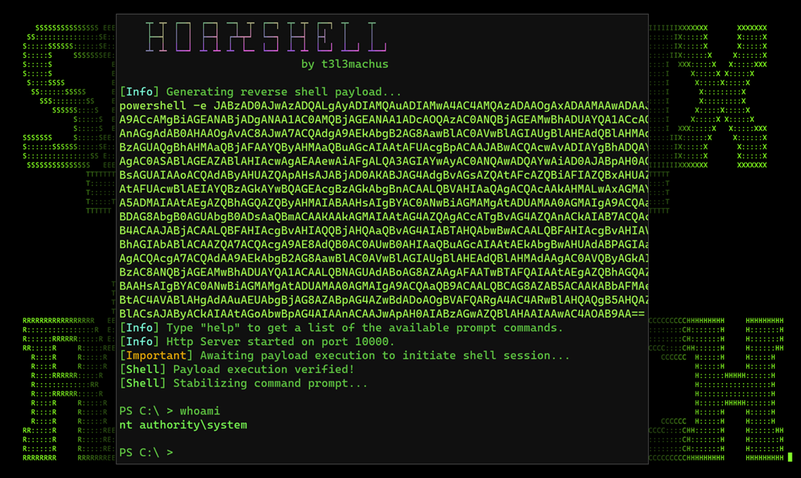
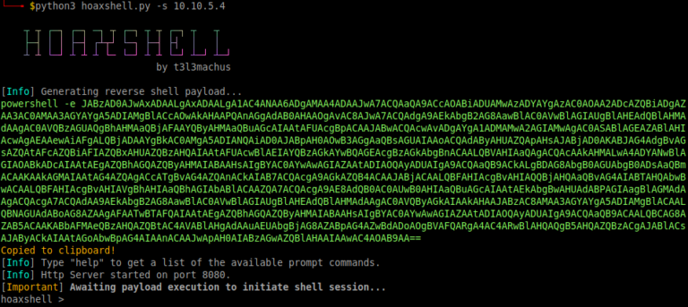
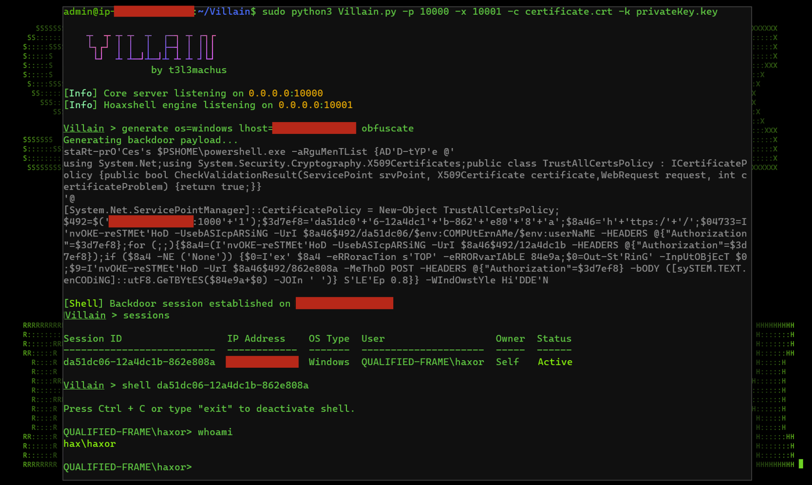
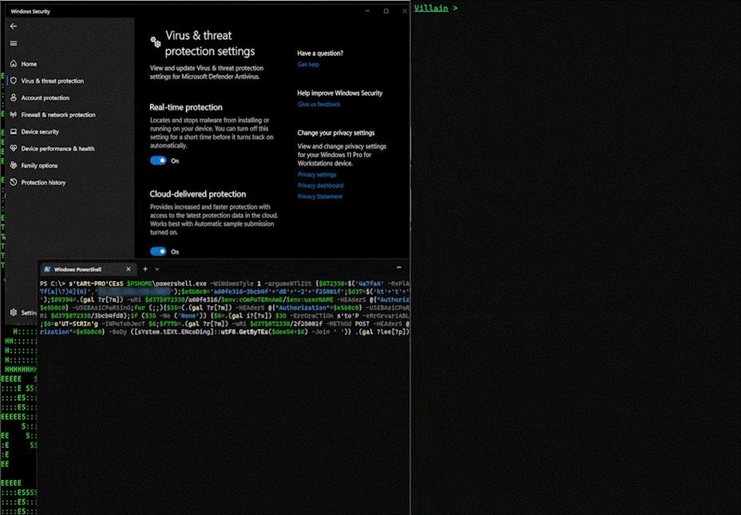
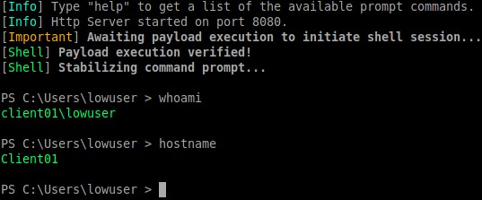
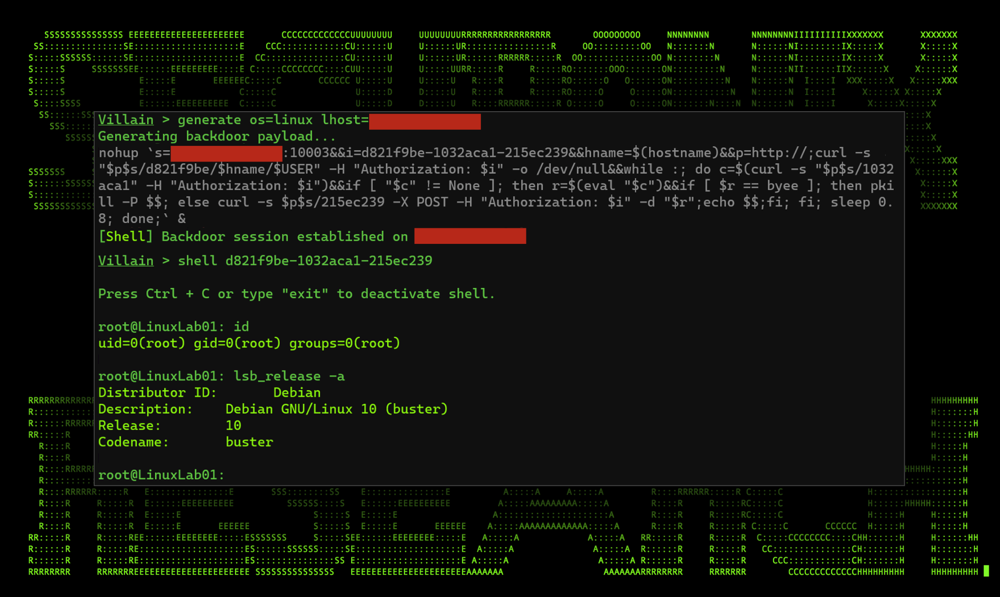
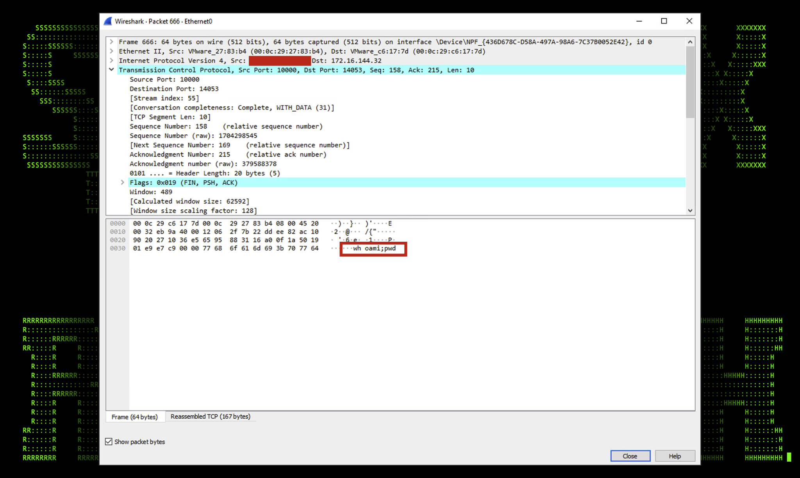
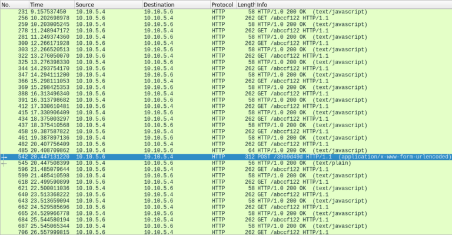
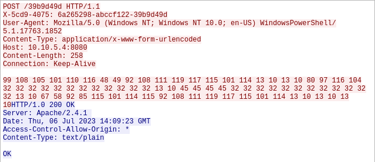
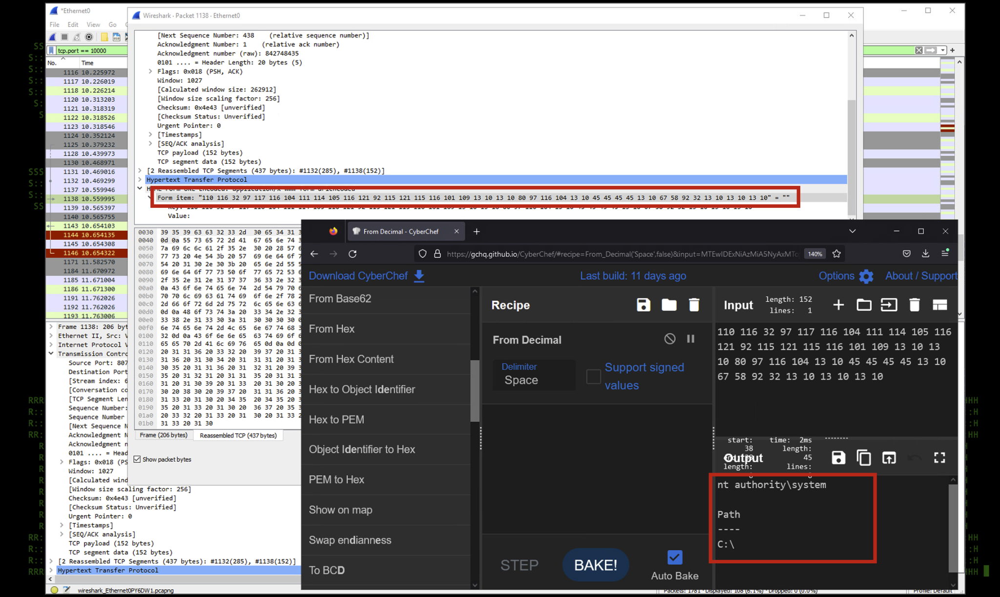

# Hoaxshell & Villain C2 Framework Research

This repository documents the practical analysis and demonstration of Command and Control (C2) frameworks, specifically focusing on **Hoaxshell** and **Villain**. It covers payload generation, real-time Windows Defender bypass mechanisms, reverse shell establishment, and network traffic exfiltration analysis using Wireshark.

---

## 1. Hoaxshell Reverse Shell Payload Generation

Generating an obfuscated PowerShell payload using Hoaxshell to establish an HTTP-based reverse shell session.

---

## 2. Payload Copy & Preparation

The generated Hoaxshell payload is copied to the clipboard, ready to be delivered and executed on the target machine.

---

## 3. Villain Framework C2 Setup

Initializing the Villain framework C2 server and configuring listener settings for session management.

---

## 4. Bypassing Windows Defender

Executing the obfuscated Hoaxshell payload on the target Windows system while successfully bypassing Windows Defender real-time protection.

---

## 5. Establishing Shell Session & Command Execution

The reverse connection is established, allowing execution of basic system commands (`whoami`, `hostname`) on the compromised host.

---

## 6. Hoaxshell Listener & Interactive Session

Demonstrating the active Hoaxshell listener interface and managing the established interactive session.

---

## 7. Villain Linux Reverse Shell

Demonstrating cross-platform C2 capabilities by establishing a Linux-based reverse shell using the Villain framework.

---

## 8. Wireshark Traffic Capture (Command Execution)

Capturing network packets during C2 communication to inspect the underlying HTTP POST and GET requests.

---

## 9. Wireshark HTTP Request Streams

Detailed inspection of captured HTTP GET request streams sent between the host and the C2 listener.

---

## 10. HTTP POST Payload Inspection

Analyzing the encrypted/encoded HTTP POST payload traffic generated during command output transmission.

---

## 11. Payload Analysis & Decoding

Using CyberChef to decode and analyze the decimal-encoded payload response captured in the PCAP file.

